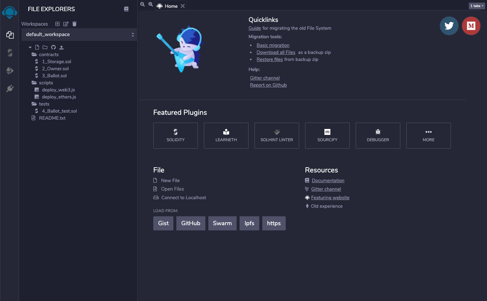
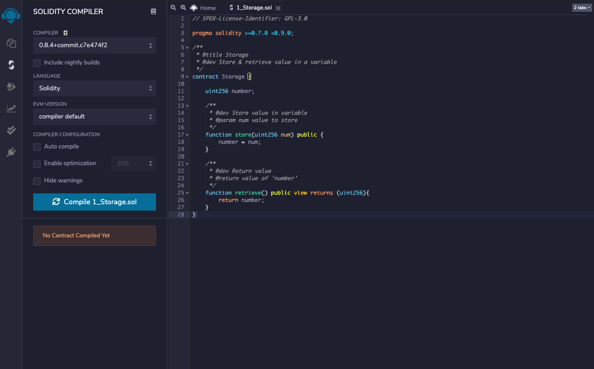
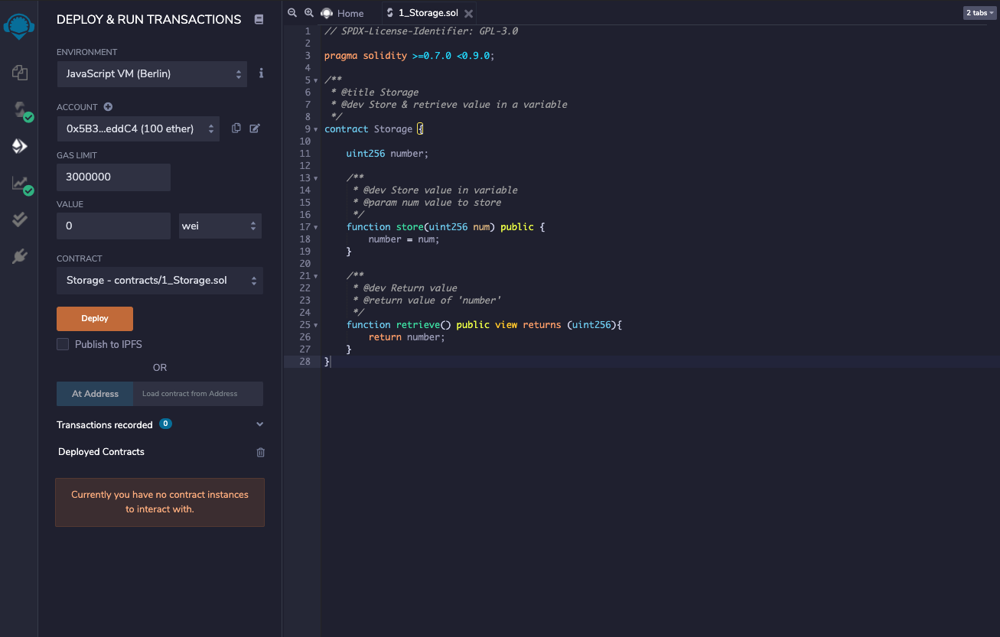
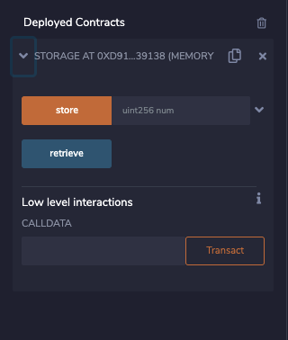

Blockchain technology today allows developers to create decentralized web applications by deploying smart contracts to the blockchain and interacting with the contracts from a frontend interface. Most web developers are familiar with at least one frontend framework such as React or Vue which are perfect for interfacing with blockchain contracts, but how does one begin to create a decentralized application without the smart contract? Let's explore a popular tool called Ethereum Remix that allows developers to explore the world of smart contracts inside a web sandbox, similiar to codesandbox.io but for Solidity. Write, compile, and deploy your contract and interface with the contract all from a web interface. No terminal required.

## Prerequisites:

- Web Browser
- Familiarity with object-oriented programming
- General understanding of <a href='https://docs.soliditylang.org/en/v0.8.6/introduction-to-smart-contracts.html' target='_blank'>Smart Contracts</a>

## Let's get started

1. Navigate to <a href='https://remix.ethereum.org/' target='_blank'>https://remix.ethereum.org/</a> This should take you to the web IDE interface.



2. As you can see there is a default workspace containing all the files you need to get started. There are even 3 sample contracts, try clicking on 1_Storage.sol:

   ```sol
   // SPDX-License-Identifier: GPL-3.0

   pragma solidity >=0.7.0 <0.9.0;

   /**
   * @title Storage
   * @dev Store & retrieve value in a variable
   */
   contract Storage {

       uint256 number;

       /**
       * @dev Store value in variable
       * @param num value to store
       */
       function store(uint256 num) public {
           number = num;
       }

       /**
       * @dev Return value
       * @return value of 'number'
       */
       function retrieve() public view returns (uint256){
           return number;
       }
   }
   ```

   This is an example of a very simple contract. The name of the contract is `Storage` and it stores data of type `uint256` in a variable called `number`. There are 2 functions or methods that are publicly available. One is called `store` and the other is called `retrieve`. The `store` function must be called with one argument of type `uint256` and all it does is update the value provided to the variable `number`. Calling on `retrieve` does not require any arguments and all it does is return the value of `number`

If that explanation didn't make any sense, that's okay. Let's compile and deploy the contract so we can get a better understanding how it works.

3. Click on the compile tab on the left sidebar (second tab from the top) and click on the button that says "Compile 1_Storage.sol"

   

   If everything compiles successfully, you will see a green check on the compile tab.

4. Click on the 3rd tab from the top, this is the deploy tab.

   

   Don't worry too much about all the different options right now, just click on the big "Deploy" button. If successfull, you will see an item appear under "Deployed Contracts" click on the tab to open the contract interface.

   

5. Let's interact with the contract

   As you can see there are 2 buttons, one representing each of the two publicly available functions. The `store` button is orange because this function mutates data inside the contract. The `retrieve` function is grey because it only reads data.

   Try clicking on the `retrieve` button

   You should get back:

   ```bash
     0: uint256: 0
   ```

   This means the function returns one piece of data (index 0) of type `uint256` and the value is `0`

   This is good because we never set the value of `number`. The default value for `uint256` is `0` so this is exactly what we would expect on a fresh deploy.

   Now lets set the value of `number` to be `3`. Enter `3` into the `store` function and click on the "store" button.

   If successful, you will notice some output on the bottom terminal with a green checkmark. This means that the transaction was successful.

   <image src='./images/remix-interaction-success.png'>

   If that was successful, then now when we retrieve the value of `number` it should tell us the value is `3`. Try clicking on `retrieve` again.

   If all of that worked, you should now get this response:

   ```bash
     0: uint256: 3
   ```

   Try setting the value of `number` to different values. What are the limitations? What happens if you try passing something other than an integer into the `store` function?

## Building the CRUD application

1. Now that we have a basic understanding of Solidity and Ethereum Remix, lets write our own CRUD application. In this example, we're going to create a decentralized application for users to produce and share their own beats. Start by renaming our `1_Storage.sol` file to `BeatBox.sol`. Update the name of the contract and remove everything inside.

   ```sol
    // SPDX-License-Identifier: GPL-3.0
      pragma solidity >=0.7.0 <0.9.0;

      contract BeatBox {

      }
   ```

   Now let's start by defining our User model. In Solidity we do this with a <a href='https://docs.soliditylang.org/en/v0.8.6/structure-of-a-contract.html#struct-types' target='_blank'>struct</a>

   When defining a struct, all you need to do is define the data type, and then give it a name. We are going to use types <a href='https://docs.soliditylang.org/en/v0.8.6/types.html#address' target='_blank'>address</a>, <a href='https://docs.soliditylang.org/en/v0.8.6/types.html#integers' target='_blank'>uint</a>, <a href='https://docs.soliditylang.org/en/v0.8.6/types.html#string' target='_blank'>string</a>, and <a href='https://docs.soliditylang.org/en/v0.8.6/types.html#fixed-size-byte-arrays' target='_blank'>bytes32[]</a>

```sol
  struct User {
        address wallet;
        uint id;
        string username;
        bytes32[] sequences;
    }
```

Next, we are going to store our User data in a <a href='https://docs.soliditylang.org/en/v0.8.6/types.html#mappings' target='_blank'>mapping</a>. In some ways mapping is analogous to a Table in a traditional SQL database. We can retrieve data on our User model by using a unique id or key. In this case, we are going to use the User address as the unique id. The name of our mapping will be called `userMap`

```sol
  mapping (address => User) userMap;
```

Finally, we are going to store references to our Users in an array so we can access all Users.

```sol
address[] userIndex;
```

All together, our contract looks like this so far:

```sol
  // SPDX-License-Identifier: GPL-3.0
  pragma solidity >=0.7.0 <0.9.0;

  contract BeatBox {
      struct User {
          address wallet;
          uint id;
          string username;
          bytes32[] sequences;
      }
      mapping (address => User) userMap;
      address[] userIndex;
  }
```

2. Now lets create a function to create a User. This function will accept 1 argument of type string. We will store this argument in <a href='https://docs.soliditylang.org/en/v0.8.6/types.html#reference-types' target='_blank'>memory</a> versus storage and call with the argument `_username`. This function is public meaning anyone can call on this function and create a User in this contract.

   ```sol
   function createUser(string memory _username) public {

    }
   ```

   Right now this function does nothing, so let's write the code to create a User. Inside the function, add the following code to create a User, save it to memory and call it `newUser`. We simply have to pass the correct arguments to our User struct and the User is created.

   ```sol
    User memory newUser = User({
        wallet: msg.sender,
        id: userIndex.length,
        username: _username,
        sequences: new bytes32[](0)
    });
   ```

   Inside a Solidity function, `msg.sender` is the address of the user who is making the function call, so we can be certain this is the wallet address of the User. `id` will be assigned a value based on the number of users in our `userIndex`. `username` will be assigned the value passed into the function, and `sequences` for now will be a bytes32 array of length 0.

   Now that we have our User saved to memory, let's add this user to our `userMap`. We can access an entry in our mapping by providing a key (in this case the address of the user) inside square brackets [] and update the entry by setting it equal to a new value (our new User)

   ```sol
    userMap[msg.sender] = newUser;
   ```

   Finally let's add a reference to this new User to our `userIndex`

   ```sol
    userIndex.push(msg.sender);
   ```

   in this way, our user `id`'s will be auto-incrementing because each user that's created will add an index to our `userIndex` array.

3. Now let's create a function to get all our Users. This function is also public, designated as `view` because it does not mutate data in the contract, and returns a User array stored in memory.

   ```sol
    function getUsers() public view returns (User[] memory) {

    }
   ```

   Again, this function doesn't currently do anything, so let's start by saving an empty User array to memory and store it in a variable called `_users`. When creating a new array in Solidity, you must define the length of an array, which in this case we want to be the number of users in our `userIndex` array, so we can use `userIndex.length`:

   ```sol
    User[] memory _users = new User[](userIndex.length);
   ```

   Now that we have our User array saved to memory, we can use a for loop to replace each item with our actual users. For each index of the array, we are going to replace that index with the actual User data from our `userMap` and access it with the reference in our `userIndex`:

   ```sol
    for (uint i = 0; i < userIndex.length; i++) {
        _users[i] = userMap[userIndex[i]];
    }
   ```

   Finally, now that our User array has been filled with our actual User data, we can simply return our `_user` array:

   ```sol
    return _users;
   ```

   Our completed function looks like this:

   ```sol
    function getUsers() public view returns (User[] memory) {
        User[] memory _users = new User[](userIndex.length);
        for (uint i = 0; i < userIndex.length; i++) {
            _users[i] = userMap[userIndex[i]];
        }
        return _users;
    }
   ```

4. Now that we have our `createUser` and `getUsers` functions, let's see if they work? Compile and deploy and create a user. Make sure you pass in data of type string, for example `'test'`

Now call on `getUsers` and you should get a response like this:

```bash
  0: tuple(address,uint256,string,bytes32[])[]: 0x5B38Da6a701c568545dCfcB03FcB875f56beddC4,0,'test',
```

This may be a bit difficult to read in this format, but you can see our User data is all there. The first argument will be the address of the wallet you are using in Remix so it will not match the example. When calling this function from a frontend, the data will be structured as an array of objects so it will be easy to work with:

```js
[
  {
    wallet: 0x5b38da6a701c568545dcfcb03fcb875f56beddc4,
    id: 0,
    username: 'test',
    sequences: [],
  },
];
```

5. As you can see, the user id is 0 because they are the first user in our userIndex (index 0). If we want to start with index 1, we can create an initial user for the developer using the `constructor`:

First, let's save the value of the developer address so we can use this in the future:

```sol
  address payable _devAddress;
```

Next, lets write the code for the constructor:

```sol
  constructor() {
      _devAddress = payable(msg.sender);
      userMap[msg.sender] = User({
          wallet: msg.sender,
          id: userIndex.length,
          username: 'developer',
          sequences: new bytes32[](0)
      });
      userIndex.push(msg.sender);
  }
```

This code will run only once, on deployment and the value of `msg.sender` will be the address of the deployer. We can save this address to our `_devAddress` so we can transfer funds to this address in the future. Also we are creating a user for the developer that will take index 0. This way our users will start with index 1. This can be helpful in validating if a wallet is an existing user.

6. Now let's create a function to update our user. This will be similiar to `createUser` but instead of creating a new User struct, we can simply identify the correct User, and update the neccessary data.

```sol
  function updateUser(string memory _username) public {

  }
```

Access the correct User and save it to storage as `_user`. Since we will be mutating the data we must use storage here:

```sol
  User storage _user = userMap[msg.sender];
```

Finally, we can simply update the username with the argument provided:

```sol
_user.username = _username;
```

The completed function looks like this:

```sol
  function updateUser(string memory _username) public {
      User storage _user = userMap[msg.sender];
      _user.username = _username;
  }
```

Compile and deploy to make sure all our functions are working as intended.

7. Now that we have our User model setup with create, read, and update functionality, lets create our Sequence Model. Sequence will contain all our instrument tracks. We can follow the same pattern for our Sequence Model.

```sol
struct Sequence {
    bytes32 id;
    address owner;
    string name;
    bytes32[] modules;
    uint createdAt;
    uint updatedAt;
}
mapping (bytes32 => Sequence) sequenceMap;
bytes32[] sequenceIndex;
```

Only difference here is we are using `bytes32` for our Sequence id so our mapping will map bytes32 to Sequence. We will use a hash function, <a href='https://solidity-by-example.org/hashing/' target='_blank'>keccak256</a> to generate our ids.

8. Function for `createSequence`

```sol
function createSequence(string memory _name) public {
    User storage _user = userMap[msg.sender];
    bytes32 sequenceId = keccak256(abi.encodePacked(msg.sender, block.timestamp, _name));
    sequenceMap[sequenceId] = Sequence({
        id: sequenceId,
        name: _name,
        createdAt: block.timestamp,
        updatedAt: block.timestamp,
        modules: new bytes32[](0)
    });
    sequenceIndex.push(sequenceId);
    _user.sequences.push(sequenceId);
}
```

Here, we are pushing the `sequenceId` to the `sequenceIndex` as well as the User's `sequences` array so the User will keep a reference to the sequence.

9. Function for `getAllSequences` - following the same pattern as `getUsers`

```sol
  function getAllSequences() public view returns (Sequence[] memory) {
      Sequence[] memory _sequences = new Sequence[](sequenceIndex.length);
      for (uint i = 0; i < sequenceIndex.length; i++) {
          _sequences[i] = sequenceMap[sequenceIndex[i]];
      }
      return _sequences;
  }
```

10. Function for `getUserSequences` - same as `getAllSequences` but only for User sequences:

```sol
  function getUserSequences() public view returns (Sequence[] memory) {
      User memory _user = userMap[msg.sender];
      Sequence[] memory _sequences = new Sequence[](_user.sequences.length);
      for (uint i =0; i < _user.sequences.length; i++) {
          _sequences[i] = sequenceMap[_user.sequences[i]];
      }
      return _sequences;
  }
```

11. Finally, lets create our Module Model this will be our instrument track:

```sol
  struct Module {
      bytes32 id;
      string instrument;
      bool beat_1;
      bool beat_2;
      bool beat_3;
      bool beat_4;
      uint createdAt;
      uint updatedAt;
  }
  mapping (bytes32 => Module) moduleMap;
  bytes32[] moduleIndex;
```

12. Function for `createModule`

```sol
  function createModule(bytes32 _sequenceId, string memory _instrument, bool _beat_1, bool _beat_2, bool _beat_3, bool _beat_4) public {
      bytes32 moduleId = keccak256(abi.encodePacked(msg.sender, block.timestamp, _instrument));
      moduleMap[moduleId] = Module({
          id: moduleId,
          instrument: _instrument,
          beat_1: _beat_1,
          beat_2: _beat_2,
          beat_3: _beat_3,
          beat_4: _beat_4,
          createdAt: block.timestamp,
          updatedAt: block.timestamp
      });
      moduleIndex.push(moduleId);
      sequenceMap[_sequenceId].modules.push(moduleId);
  }
```

13. Function for `getSequenceModules`

```sol
  function getSequenceModules(bytes32 _sequenceId) public view returns (Module[] memory) {
      Sequence memory _sequence = sequenceMap[_sequenceId];
      Module[] memory _modules = new Module[](_sequence.modules.length);
      for(uint i = 0; i < _sequence.modules.length; i++) {
          _modules[i] = moduleMap[_sequence.modules[i]];
      }
      return _modules;
  }
```

14. Finally, just for fun let's create a function for users to "buy me a coffee" if they want to support the developer.

```sol
  function buyMeACoffee() public payable {
      uint contribution = msg.value;
      _devAddress.transfer(contribution);
  }
```

This function takes the value of the funds sent (msg.value) and transfers it to the `_devAddress` anyone can call on this function to send funds to the developer so the function is designated `public` and `payable`

## Next steps

1. Example repository can be seen <a href='https://github.com/asooge/BeatBox' target='_blank'>here</a>

2. Now we have the beginning of an application capable of creating, reading and updating data on the blockchain. Give it a try, experiment, modify for your own applications. This example hopefully is a good introduction to smart contract development but really only scratches the surface. Some key concepts that were not included is validating function calls with `assert` and `require` you can read about that <a href='https://docs.soliditylang.org/en/v0.8.6/control-structures.html#error-handling-assert-require-revert-and-exceptions' target='_blank'>here</a>, and emitting events which you can read about <a href='https://docs.soliditylang.org/en/v0.8.6/contracts.html#events' target='_blank'>here</a>
