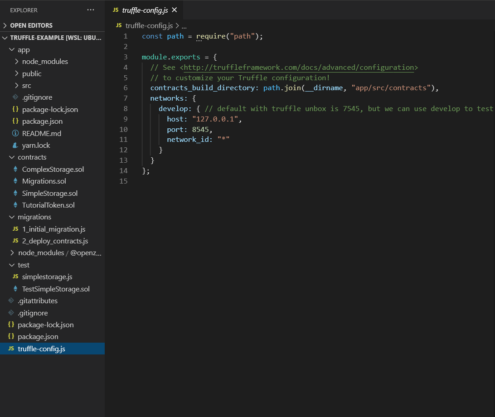
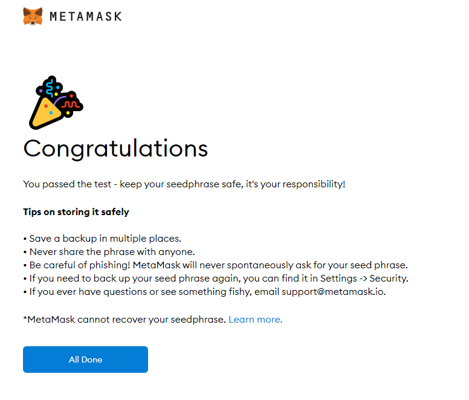

# How to start Ethereum blockchain development

#### Using Truffle Suite and React

Many developers are beginning to take an interest in blockchains and decentralized app development. Public blockchains are a way that developers can deploy smart contracts that users can interact with in a way that is secure, transparent, and accessible. There are many potential use cases, such as decentralized finance, insurance, and even gaming, but sometimes getting started is the hardest part. Here, we will learn how to get started with our dev environment and how to run a blockchain on our local machine.

## Prerequisites:

- Node JS - if you don't have node you can download <a href='https://nodejs.org/en/' target='_blank'>here</a>
- Understanding of <a href='https://reactjs.org/' target='_blank'>React</a> framework
- Understanding of command-line
- Terminal of choice

## Let's get started

1. Install <a href='https://www.trufflesuite.com/' target='_blank'>truffle</a>. We're going to install truffle globally, using npm. Enter into your terminal:

   ```bash
   npm install -g truffle
   ```

1. Make a directory for your new project and navigate to your new directory:

   ```bash
   mkdir truffle-example
   ```

   ```bash
   cd truffle-example
   ```

1. Unbox a truffle box. We're going to use one called drizzle. There are many other boxes available <a href="https://www.trufflesuite.com/boxes" target="_blank">here</a>

   ```bash
   truffle unbox drizzle
   ```

1. Let's see what we have. Open the contents in your text editor of choice. For example, I'm using vs-code `code` command:

   ```bash
   code .
   ```

   Inside of our project, we should have an app/ directory. This is essentially a create-react-app that has additional features that allows it to integrate with a blockchain, either running on our computer or on the ethereum mainnet. We also have a contracts/ directory which contains our 4 example contracts. Notice the file extensions are .sol for solidity. Next, we will see a directory for migrations/ which allows us to deploy changes to our smart contracts. We also have a test/ directory which contains our smart contract test files. Finally we have a package-lock.json, package.json, and truffle-config.js files.

   

1. Now lets compile our contracts and try to run our app.

   ```bash
   truffle compile
   ```

1. Open a new terminal window, navigate into our React app and lets start it:

   ```bash
   cd app
   ```

   ```bash
   npm start
   ```

   If successful, your app should open in a new browser tab and you should see a Loading... message. This is because the app is trying to connect to a blockchain but unable to. To resolve this, we will need to deploy our contracts to a local blockchain using <a href='https://www.npmjs.com/package/ganache-cli' target='_blank'>ganache-cli</a>

## Use ganache-cli to run a local blockchain

1. Open a new terminal window. We're going to install ganache-cli globally:

   ```bash
   npm install -g ganache-cli
   ```

1. Run ganache-cli to get a local ethereum blockchain running on your computer.

   ```bash
   ganache-cli
   ```

   when successful, this command will provide you with 10 available accounts and corresponding private keys, each account with 100 ETH. Will also provide a mnemonic or 12-word phrase. The blockchain will listen on port 8545.

1. Let's copy this 12-word mnemonic and create a command to run our blockchain as deterministic and mnemonic:

   in our code editor, we are going to edit our package.json inside our truffle-example directory. We are going to create a command called `ganache` to run our blockchain and persist it to a db. In this example, I'm using the mnemonic: 'picture tray motion shuffle action fun puzzle velvet sample trip reject beef' but you can use the mnemonic that was generated by your ganache-cli or another mnemonic as you please. In order for our data to persist, we will need to run ganache-cli with the following flags:

   - `-d` or `--deterministic`: Generate deterministic addresses based on a pre-defined mnemonic.

   - `-m` or `--mnemonic`: Use a bip39 mnemonic phrase for generating a PRNG seed, which is in turn used for hierarchical deterministic (HD) account generation.

   - `--db`: Specify a path to a directory to save the chain database. If a database already exists, ganache-cli will initialize that chain instead of creating a new one.

   - `-i` or `--networkId`: Specify the network id ganache-cli will use to identify itself (defaults to the current time or the network id of the forked blockchain if configured)

   full documentation for ganache-cli can be found <a href='https://github.com/trufflesuite/ganache-cli#readme' target='_blank'>here</a>

   Here is the command I'm using for this example. We are specifying the db directory `./ganache_db` and the networkId `1`.

   ```bash
   ganache-cli -d -m picture tray motion shuffle action fun puzzle velvet sample trip reject beef --db ./ganache_db -i 1
   ```

   Your package.json file should now have 2 scripts we can run with npm: `test` and `ganache`

   ```json
   "scripts": {
       "test": "echo \"Error: no test specified\" && exit 1",
       "ganache": "ganache-cli -d -m picture tray motion shuffle action fun puzzle velvet sample trip reject beef --db ./ganache_db -i 1"
   },
   ```

1. Now, every time we run this command, our blockchain will store all our changes and users and save the history to our 'database' directory. Lets go back to our terminal that is running ganache-cli, end the process, and run our new command:

   ```bash
   npm run ganache
   ```

   If successful, you will notice that a directory is created in our project directory called `ganache_db/` as we described in our command. This is where blockchain history will be stored. We can add this directory to our .gitignore to prevent from commiting this directory.

   End the process and re-run the command. Make sure the Available Accounts and Private Keys are identical every time you run the command. If not, review your command and make sure you are providing the -d -m and -i flags. (-m and -i must have proper arguments)

1. Now that we have our blockchain running locally, we can deploy our drizzle contracts to our local blockchain. Make sure your blockchain is running and let's open a new terminal. Navigate back to our `truffle-example` directory and let's deploy our contracts.

   ```bash
   cd truffle-example
   ```

1. Run your migrations, specifying the network: develop

   ```bash
   truffle migrate --network develop
   ```

   This will deploy our contracts to our local blockchain. Make sure you give it the `--network develop` so it will deploy to the blockchain running on port 8545. By default it will try to deploy to port 7545 which doesn't currently have a blockchain running.

   When successful, you will see the 4 example contracts deployed to your blockchain, which will cost a certain amount of ETH. Now that our contracts are deployed, we can use the Metamask browser extension to connect our blockchain to our web browser.

## Install Metamask browser extension and import your accounts

1. Go to https://metamask.io and install the Metamask extension for your browser of choice (Chrome or Firefox).

1. Once installed, a new tab should open with the Metamask logo. Click on "Get Started" and "Create a Wallet" and agree to terms and conditions. Create a password and click "Create". You will be given a 12-word mnemonic that you can use to access or recover your Metamask wallet from any computer. Make sure to store this 12-word mnemonic in a safe and secure way. Especially if you are going to use this wallet to transact on the Ethereum Mainnet.

1. Click on "Next" and it will ask you to confirm your 12-word mnemonic. If successful, it will say "Congratulations". Click on "All Done"



1. Go to your Metamask and click on the top dropdown where it says "Ethereum Mainnet" to select your network and select Localhost 8545

1. Click on the avatar in the top-right corner and select Import Account

1. Here, you can paste one of the Private Keys that is displayed when you run `npm run ganache`. Lets copy and paste the first Private Key and click Import.

1. Metamask should now display your account with the corresponding public key (displayed under Available Accounts in the Ganache CLI) with an account balance close to 100 ETH (minus the amount spent to deploy your contracts).

1. If you want, you can import your other accounts, but really we only need one account right now to get started.

## Start your Drizzle App

1. Now that we have our Metamask and our contracts deployed to our local blockchain, lets go back to our frontend app, end the process (if still running) and restart:

```bash
npm start
```

1. We should now see our drizzle application that we can interact with our blockchain. Let's test the first contract, "Simple Storage" to make sure we can update, read, and persist data to our blockchain. Set the value to any number and submit. You should see the value update soon after.

1. Now shut down the ganache-cli and restart. Let's make sure the data is persisting. Your application should load with the previous value that you set. Congratulations, you now have a local blockchain that you can persist data to.

1. Experiment with the other contracts and inspect the code for the contracts, and the drizzle app. The great thing about drizzle is that it takes care of the connection with the blockchain and will listen for any changes. That way any time there's a change to one of your contracts, the blockchain will emit an event that drizzle will receive and immediately update your app's state.

## Next steps

1. Now that we are setup with our local environment, we can update our smart contracts using the Solidity programming language or write new contracts, then compile and deploy to our network. If we want to start a new project, we can use the same command for ganache, just specify a different networkId and it will create a new network, but you will still be able to use the same accounts that we linked to our Metamask.

1. A good place to start is the <a href='https://solidity.readthedocs.io/en/v0.7.4/' target='_blank'>Solidity documentation</a>

1. Practice creating smart contracts with <a href='https://remix.ethereum.org/' target='_blank'>Ethereum Remix</a>

1. If you prefer a more tutorial-based approach, try <a href='https://cryptozombies.io/' target='_blank'>Crypto Zombies</a>

1. Good luck and have fun!
