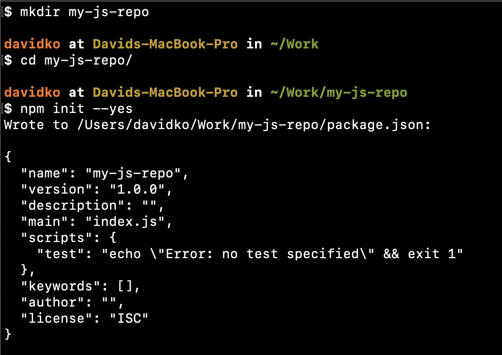
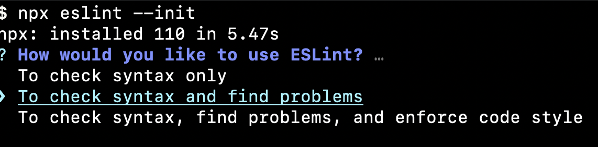
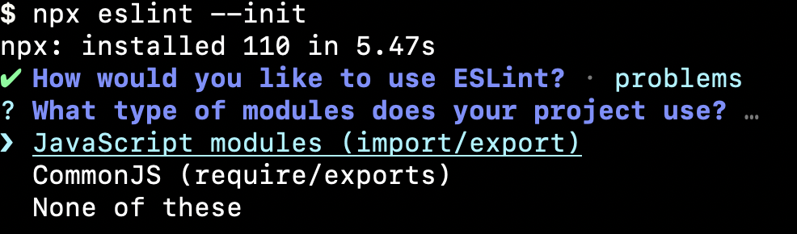
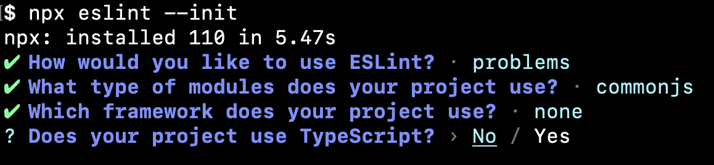
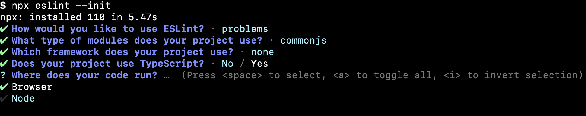
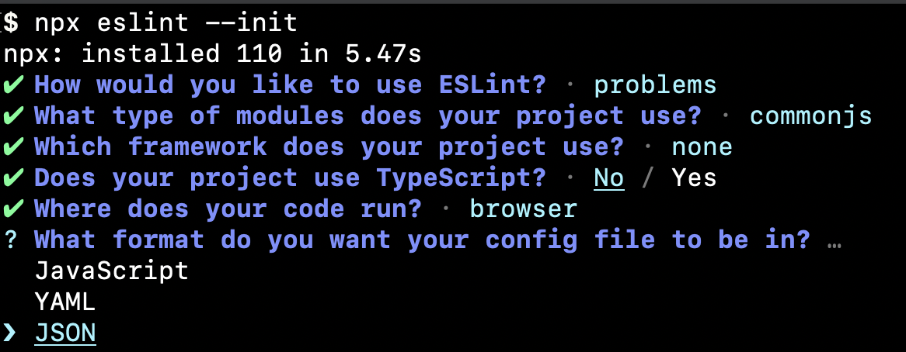
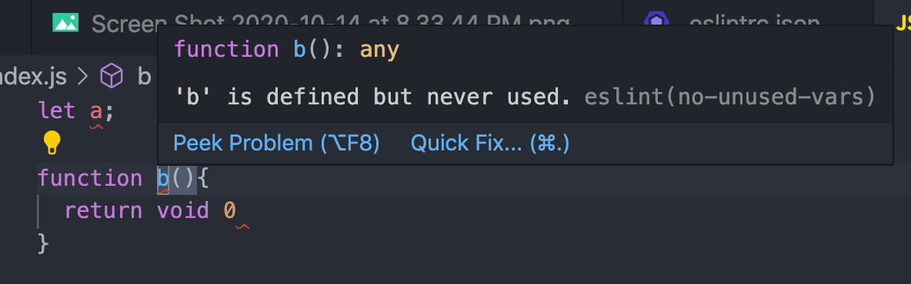
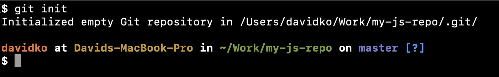
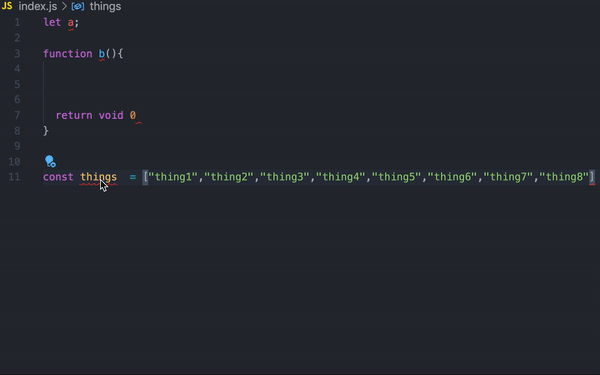

### Prerequisites:

VsCode (Visual Studio Code):
[VsCode download](https://code.visualstudio.com/)
[VsCode prettier extension](https://marketplace.visualstudio.com/items?itemName=esbenp.prettier-vscode)
[VsCode eslint extension](https://marketplace.visualstudio.com/items?itemName=dbaeumer.vscode-eslint)

Npm (Node Package Manager):
[Npm download](https://nodejs.org/en/)
or with Homebrew:

```bash
brew install node
```

Git:
[Git install guide](https://git-scm.com/book/en/v2/Getting-Started-Installing-Git)

### Setting up a repository



```bash
mkdir <new folder name>
cd <to the newly created folder>
npm init --yes
```

### Setting up prettier

```bash
touch .prettierrc
```

Here is my default prettier config. There are more options available that you can checkout [here](https://prettier.io/docs/en/options.html)

```json
{
  "trailingComma": "all",
  "tabWidth": 2,
  "semi": true,
  "singleQuote": true,
  "printWidth": 80
}
```

### Setting up eslint

```bash
npx eslint --init
```

Note: if npx does not work, you can try installing eslint globalling with `npm i -g eslint` or upgrading node to a version past v5.2.0


Choose your use case. I usually pick "To check syntax and find problems"


Choose your modules. For react projects, JavaScript modules will work. For node base projects, the CommonJs work. You can get JavaScript modules to work with node base projects with Babel


Choose your framework. This test repo has no built in framework


Choose whether you want TypeScript or plain JavaScript. This test repo uses just JavaScript


Choose whether you want your project to run on Node or the Browser. This test repo uses Node. React / Vue / Angular projects will use Browser.


Choose what kind of file type your eslint config will be. JSON is the most popular but having a config file in JavaScript allows you to add comments.


Pick the latest. Always.


If you have successfully set up eslint with the VsCode eslint extension, there should be highlighting available to warn you of syntax errors.

#### Adding eslint rules

Here are some rules I like to add for my projects to my `.eslintrc.json` file.

```json
"space-before-function-paren": [
      "error",
      {
        "anonymous": "never",
        "named": "never",
        "asyncArrow": "always"
      }
    ],
    "semi": ["error", "always"],
    "react/prop-types": 0,
    "comma-dangle": ["error", "always-multiline"]
```

### Setting up git

```bash
git init
```



### Settings up workspace settings for VsCode

```bash
mkdir .vscode
cd .vscode
touch settings.json
```

Here are my baseline vscode settings.
"formatOnSave" auto formats whenever you save.
"wordWrapColumn" changes the texting wrapping limit.

```json
{
  "editor.formatOnSave": true,
  "editor.wordWrapColumn": 140
}
```

### Wrapping up

Once everything is set up, you should be able to see eslint highlighting and prettier formatOnSave do its magic! Auto formatting helps with dealing with projects maintain a specific code format.


