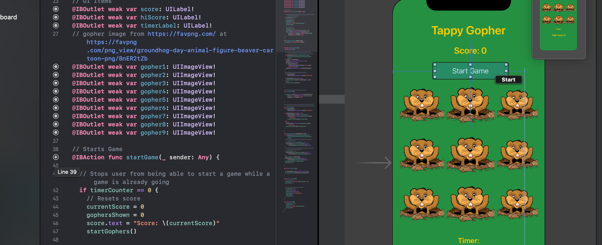
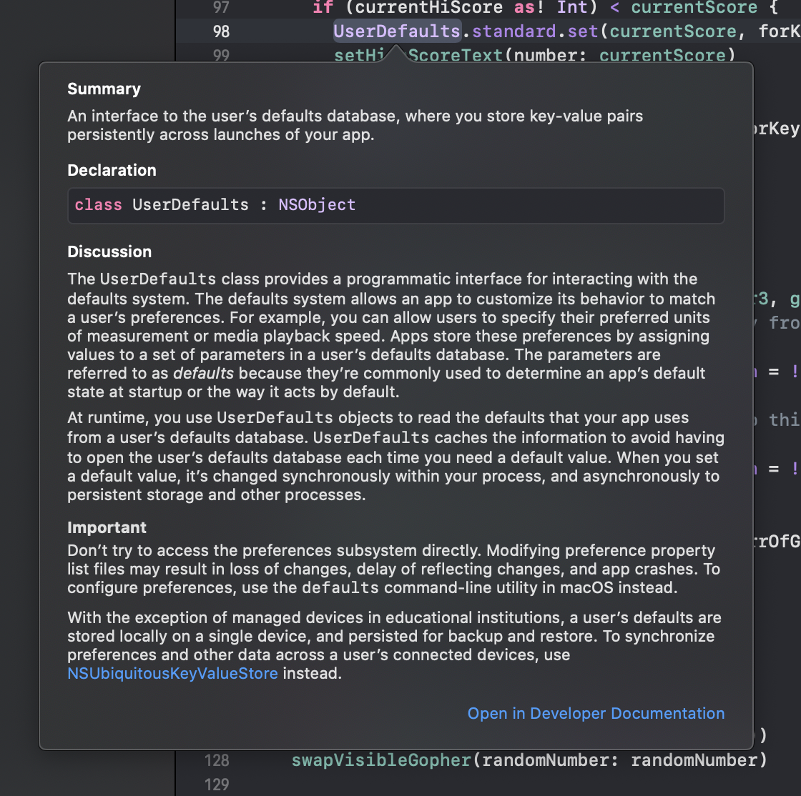

I recently released my first iPhone app on the App Store - [Tappy Gopher](https://apps.apple.com/us/app/tappy-gopher/id1497439278). It had been a goal of mine to release an app, but I had always imagined I would use a framework like React Native or Ionic since I am primarily a JavaScript Developer. Instead, on a whim, I decided to work on the app using the iOS native language, Swift. While working on this app, I noticed some benefits of Swift and Xcode (the IDE for macOS). I would highly suggest diving into Swift if you are interested.

## Getting Started

The first thing to note is that Xcode is notoriously a mac-only IDE, and is also the primary and easiest way to code apps using Swift. Assuming you have a mac and Xcode, laying out an app in Swift using storyboards can be very simple. Each basic Swift app that is created will have a `Main.Storyboard` and a ViewController file. A storyboard is a visual representation of the user interface of an iOS application, showing screens of content and the connections between those screens. In addition, a storyboard enables you to connect a view to its controller object and to manage the transfer of data between view controllers.

This Storyboard/Controller setup creates a coding environment that allows you to look at what the app will look like in the `Main.Storyboard` file and practically drag and drop buttons, images, or any DOM element into your ViewController to create variables! After your UI is connected to a function or variable, a helpful icon by the line number will highlight that element on your storyboard.



You can add elements directly to the `Main.Storyboard`, as well. Positioning elements is as easy as dragging and dropping them within the storyboard. To make the app responsive across different iOS screen sizes, Xcode also provides the ability to add responsive constraints on each element to control their size and positioning.

## Coding in Swift

```swift
  override func viewDidLoad() {
    super.viewDidLoad()

    // This sets each gopher to be tappable and also connects them to increment the score when tapped
    let arrOfGophers = [gopher1, gopher2, gopher3, gopher4, gopher5, gopher6, gopher7, gopher8, gopher9]
    for gopher in arrOfGophers {
      gopher?.isUserInteractionEnabled = true
      gopher?.isHidden = true
      let gestureRecognizer = UITapGestureRecognizer(target: self, action: #selector(scoreUp))
      gopher?.addGestureRecognizer(gestureRecognizer)
    }

    // Gets saved hi-score and displays text
    let currentHiScore = UserDefaults.standard.object(forKey: "hi-score")

    if (currentHiScore as? Int) != nil {
      setHighScoreText(number: currentHiScore as! Int)
    } else {
      setHighScoreText(number: 0)
    }

  }
```

The ViewController should come pre-built with a `viewDidLoad` lifecycle function. This function is run once the app loads to populate the view and give functionality to the elements. This function is called after the view controller has loaded its view hierarchy into memory. You usually override this method to perform additional initialization on views that were loaded.

In the case of Tappy Gopher, I want the users to be able to tap the images of the gophers, hide all the gopher images from view, and display the user's current high score when the app loads.

You may have already noticed some features from the code snippet and screenshot that highlight some cool features of Swift. I'll call out a few of them and briefly explain them below:

#### User Defaults

UserDefaults are equivalent to web browser's localstorage - you can save information about the app directly onto the phone's memory. While using it as a database for the app is bad practice, saving user information and small amounts of data is where it excels. There is a larger database system for apps that need to store more information (Core Data).

#### Inferred Types

I had experience providing types for variables in TypeScript, but Swift demands a much stricter use of types. While it can slow you down initially, once you get into the app it helps you write cleaner code and catch errors before attempting to compile the code.

#### Declaring Variables

This could seem strange if you have a JavaScript background, but in Swift the variable `let` defines a constant value that cannot be changed afterwards. If the value of a function needs to be able to change during runtime, you should use the `var` keyword instead when declaring variables.

#### Swift's API

Swift has a very large API. `UITapGestreRecognizer` and `UserDefaults` are two examples of pre-existing functions, but it goes beyond that. All images have pre-set attributes like `isUserInteractionEnabled` and `isHidden`. For detailed information on the API and what is available, you can option+click any variable to open a documentation dropdown. If the information provided in the dropdown isn't enough, there is an entire Developer Documentation section of Xcode that provides more information than you will ever need.



## Further Reading

With the above overview, you should have an idea of how you can approach diving into Xcode and create a single screen iOS app. Building your own simple app is the best way to start learning the language. If you want to do more in-depth reading about some of the topics I mentioned above, check out these links:

- [Read More about how to connect the UI to the Code](https://developer.apple.com/library/archive/referencelibrary/GettingStarted/DevelopiOSAppsSwift/ConnectTheUIToCode.html).
- [Read More about Core Data and Swift Databases](https://developer.apple.com/documentation/coredata)
- [Read More about storyboard constraints and responsive iOS design](https://medium.com/@nikeshakya51/responsive-design-in-ios-b35dc7f22821)

In addition, this post is focused entirely on Swift and storyboards. Apple has introduced SwiftUI as an alternate method for building iOS apps, which allows much greater control over the positioning of elements from entirely within the code. It has a higher barrier to entry than a storyboard (nothing is easier than drag and drop), but is still fairly easy and there are plenty of tutorials out there to help you learn.

- [Read More about SwiftUI here](https://developer.apple.com/xcode/swiftui/)

Apple also has their own tutorial to help you understand SwiftUI. It will take about 4 and a half hours, but is completely free! [Learn Swift here](https://developer.apple.com/tutorials/swiftui/)
