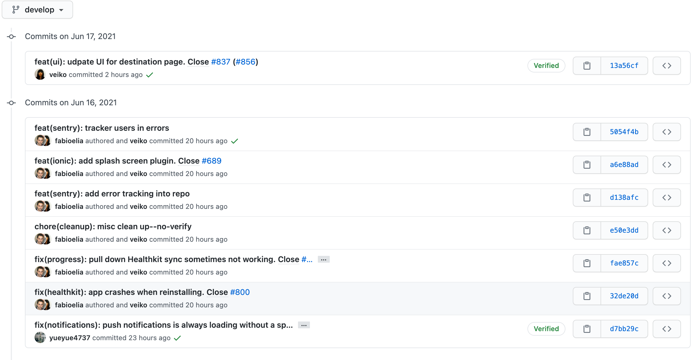

For both new and experienced developers, when it comes to workflow there are many valuable rules and tools that we can make use of. Today I'd like to focus on git PR/commit messages and overall PR review etiquette.

## GIT Common use cases

Git is a Version Control System (VCS). It allows you to track and organize changes to your files, and it makes working on projects with multiple people much easier.

While the usage of a VCS is meant to simplify, and without a doubt it's an indespensible tool for any software development team, there are caveats that newer and/or self-taught devs often run into. The purpose of this post is to discuss and help resolve the most common issues we all run across from time to time.

Here's a list of the most common scenarios, tasks, and etiquette rules that devs must learn and be mindful of to successfully work with git in a team environment.

### Commit messaging

Taken from http://karma-runner.github.io/5.2/dev/git-commit-msg.html

Many projects and companies have thier own philosophy to follow, but the purpose of Karma's approach is to maximize the ability of devs to make descriptive yet consise commit messages.

Example:

```sh
fix(middleware): ensure Range headers adhere more closely to RFC 2616

Add one new dependency, use `range-parser` (Express dependency) to compute
range. It is more well-tested in the wild.

Fixes #2310
```

The first line cannot be longer than 70 characters, the second line is always blank and other lines should be wrapped at 80 characters. The type of the commit message is the first word in the commit message ("fix" in this case). The scope is written in the parenthesis and is typically the component, feature or area that is being updated. Type and scope should always be lowercase as shown below.

Allowed `<type>` values:

```sh
- feat (new feature for the user, not a new feature for build script)
- fix (bug fix for the user, not a fix to a build script)
- docs (changes to the documentation)
- style (formatting, missing semi colons, etc; no production code change)
- refactor (refactoring production code, eg. renaming a variable)
- test (adding missing tests, refactoring tests; no production code change)
- chore (updating grunt tasks etc; no production code change)
```

### Rebasing vs Merging a main branch into your existing feature branch.

#### Rebasing

When rebasing, your feature branch begins on the tip of the main branch, effectively incorporating all of the new commits in main. But, instead of using a merge commit, rebasing re-writes the project history by creating brand new commits for each commit in the feature branch.

Check here for an excellent set of instructions on how to rebase https://git-scm.com/book/en/v2/Git-Branching-Rebasing

<image style="background: #fff" x="50%" y="50%" src="./Rebasing_feature_branch_into_main.svg" width="50%">

<sub>Image from https://www.atlassian.com/git/tutorials/merging-vs-rebasing</sub>

#### Merging

**In almost any scenario where you have a feature branch and need to bring in the latest main branch changes, don't do this :)**

When merging, a merge commit is created in the feature branch which adds the histories of both branches.

<image style="background: #fff" src="./Merging_main_into_feature.svg" width="50%">

<sub>Image from https://www.atlassian.com/git/tutorials/merging-vs-rebasing</sub>

The addition of multiple merge commits can make your pull request hard to understand. In some situations merging will update refs on each commit, which ends up making it _look_ like merged code from the main branch is a commited change in your PR. In this case, you need to rebase your changes on top of the main branch to get those refs reverted back to main (like you should have done in the first place).

### Merge conflicts when rebasing

Whether rebasing or merging, if merge conflicts come up, those should always be handled with careful attention to not break others code that you have overlapped with.

https://docs.github.com/en/github/collaborating-with-pull-requests/addressing-merge-conflicts/resolving-a-merge-conflict-using-the-command-line

When resolving, in VSCode you will see something like this:
<image style="background: #fff" src="./rebase-merge-conflict.png" width="50%">

Note that when rebasing, your initial logical thinking that Current is your branch while Incoming is Master is actually backwards --Your code is considered incoming because you're rebasing atop the main branch.

### Squashing commits via interactive Rebasing

Interactive rebasing is a great way to clean up your feature branch commits for both new devs and experienced as well. Interactive rebasing allows you to squash newer commits into successively older ones.

In the below example, the main goal of adding the component and feature tests was committed in the following commits:

```sh
07c5abd feat(LoginButton): Add click event handler
de9b1eb refactor(LoginButton): Remove incorrect target element
fa20af3 test(LoginButton): Add feature tests
3e7ee36 style(LoginButton): Add missing semi-colon
```

Along with that were 2 other commits; one for an incorrect targeted element and one for a missing semi-colon.

In this case, we only want to show a commit for the component, and a commit for the test. So we're going to interactively rebase the last 4 commits:

```sh
git rebase -i HEAD~4
```

```sh
pick 07c5abd feat(LoginButton): Add click event handler
pick de9b1eb refactor(LoginButton): Remove incorrect target element
pick fa20af3 test(LoginButton): Add feature tests
pick 3e7ee36 style(LoginButton): Add missing semi-colon

# Rebase 8db7e8b..fa20af3 onto 8db7e8b
#
# Commands:
#  p, pick = use commit
#  r, reword = use commit, but edit the commit message
#  e, edit = use commit, but stop for amending
#  s, squash = use commit, but meld into previous commit
#  f, fixup = like "squash", but discard this commit's log message
#  x, exec = run command (the rest of the line) using shell
#
# These lines can be re-ordered; they are executed from top to bottom.
#
# If you remove a line here THAT COMMIT WILL BE LOST.
#
# However, if you remove everything, the rebase will be aborted.
#
# Note that empty commits are commented out
```

When this screen opens, you want to change pick to squash for any commits you want squashed into the previous commit

```sh
pick 07c5abd feat(LoginButton): Add click event handler
squash de9b1eb refactor(LoginButton): Remove incorrect target element
pick fa20af3 test(LoginButton): Add feature tests
squash 3e7ee36 style(LoginButton): Add missing semi-colon
```

Once this is done, your terminal / code editor will have a separate popup for each of the picks, where you can choose to keep any commit messages. The ones that are squashed will show as subcommits in the git history. You can also remove those "subcommits" by removing "refactor(LoginButton): Remove incorrect target element" and "style(LoginButton): Add missing semi-colon", respectively. Another way to remove subcommits automatically is to use fixup instead of squash.

Once done, `git log` will show

```sh

commit fa20af3 (HEAD -> mybranch)
Author: me <me@f1v.co>
Date:   Tue Jun 15 11:51:07 2021 -0400

    test(LoginButton): Add feature tests

commit 07c5abd
Author: me <me@f1v.co>
Date:   Tue Jun 15 10:54:05 2021 -0400

    feat(LoginButton): Add click event handler

commit 0dd387b (master)
Author: someoneelse <someoneelse@f1v.co>
Date:   Tue Jun 15 10:54:05 2021 -0400

    feat(AnotherComponent): Add handling of API requests

...
```

### PR titles

Different organizations follow different approaches. Here at F1V, we follow Karma's approach


For PR titles in other organizations, you should be mindful to follow the typical approach that you see regarding PR titles. When in doubt, ask!

For example, you may see a Jira ticket number at the beginning of each branch commit, along with a description. In this case, prefixing your PR title with the ticket number is the standard that you, as a contractor tasked with working in that team's environment, should follow:

```sh
EE-22248 - update selector to handle unassigned case (#9112)

EE-22248 - remove duplicate field (#9116)

EE-22960 - Admin Diag Results - Fixed Comparison Bar not showing up in Placement By Domain drawer if no Level 1 (Green Stripe) Students (#9113)
```
